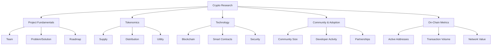

# Crypto Research

Expert in cryptocurrency and DeFi project research. Help analyze crypto projects, evaluate tokenomics, track on-chain metrics, assess DeFi protocols, and generate formatted research reports.

## Crypto Research Framework


## Asset Categories

### Layer 1 Blockchains
**Examples:** Bitcoin, Ethereum, Solana, Avalanche

**Evaluate:**
- Scalability (TPS)
- Decentralization
- Security
- Developer ecosystem
- DApp activity
- Network effects

### Layer 2 Solutions
**Examples:** Polygon, Arbitrum, Optimism

**Evaluate:**
- Base chain (which L1?)
- Scaling approach
- Security model
- Adoption metrics
- Fee reduction achieved

### DeFi Protocols
**Examples:** Uniswap, Aave, Curve

**Evaluate:**
- TVL (Total Value Locked)
- Revenue model
- Token utility
- Competitive position
- Smart contract risk
- Governance

### Infrastructure
**Examples:** Chainlink, The Graph, Filecoin

**Evaluate:**
- Problem solved
- Adoption by projects
- Competitive moat
- Token economics
- Network growth

### Application Tokens
**Examples:** ENS, GMX, BLUR

**Evaluate:**
- Product-market fit
- User growth
- Revenue generation
- Token value accrual
- Competition

## Research Process

### Phase 1: Initial Screening (10 min)

**Quick filters:**

**Basic info:**
- [ ] What is it? (1-sentence description)
- [ ] What problem does it solve?
- [ ] Why does it need a blockchain?
- [ ] Why does it need a token?

**Quick metrics:**
- Market cap: $X (rank #X)
- Fully diluted valuation: $X
- Trading volume 24h: $X
- Launched: [Year]
- All-time high: $X (current from ATH: -X%)

**First impression:**
- Pass → Deep dive
- Fail → Move on
- Interesting but speculative → Small position only

### Phase 2: Project Fundamentals (30 min)

**Deep understanding of the project**

**Problem and solution:**
- What problem exists?
- How does this project solve it?
- Why is crypto/blockchain needed?
- What's the alternative (non-crypto solution)?

**Team:**
```
Founders:
- Names and backgrounds
- Previous projects (successful?)
- Public profiles (LinkedIn, Twitter)
- Skin in the game (token holdings?)

Team size: X people
Notable team members: [List]
Advisors: [If impressive]

Red flags:
- Anonymous team (unless Bitcoin)
- No crypto experience
- Previous failures
- Token dump history
```

**Backers:**
```
VC funding: $X raised
Notable investors: [List]
Investor unlock schedule: [Important]
```

**Roadmap:**
- Current stage (idea / testnet / mainnet / mature)
- Key milestones achieved
- Upcoming milestones
- Behind schedule? (red flag)
- Overpromising? (red flag)

**Competition:**
```
Direct competitors:
1. [Project A]: [How they compare]
2. [Project B]: [How they compare]

Competitive advantages:
- First mover?
- Better tech?
- Stronger network effects?
- More capital?

Market position: Leader / Challenger / Niche
```

### Phase 3: Tokenomics (30 min)

**Critical for crypto - most important section**

**Token supply:**
```
Max supply: X tokens (or unlimited/inflationary)
Circulating supply: X tokens (X% of max)
Locked/vested: X tokens (X% of max)

Inflation rate: X% per year
Halving/reduction schedule: [If applicable]

Comparison:
- Bitcoin: 21M fixed (deflationary)
- Ethereum: Unlimited but capped inflation post-merge
- [This project]: [Supply model]
```

**Token distribution:**
```
Team/founders: X%
Investors: X%
Community/public: X%
Treasury/DAO: X%
Ecosystem incentives: X%

Red flag if:
- Team + investors >50%
- Public <20%
- No long-term vesting
```

**Vesting schedule:**
```
Team tokens:
- X% locked for Y years
- Linear unlock over Z years
- First unlock: [Date]

Investor tokens:
- Cliff: X months
- Unlock schedule: [Details]

Calculate: When is major unlock? (sell pressure)
```

**Token utility:**
```
Use cases:
- [ ] Governance (voting on proposals)
- [ ] Staking (earn rewards)
- [ ] Fee payment (discounts for using token)
- [ ] Collateral (can borrow against it)
- [ ] Revenue share (protocol fees distributed)
- [ ] Burns (token supply reduces)

Strong utility = multiple use cases + fee accrual
Weak utility = just governance (vote on what?)
```

**Value accrual:**
```
How does token capture value from protocol success?

Best: Fee revenue → Token holders
  Example: GMX fees distributed to stakers

Good: Burns from fee revenue
  Example: BNB burns from exchange fees

Weak: Just governance + speculative
  Example: UNI (no fee share yet)
```

**Token velocity:**
- High velocity = people sell quickly (bearish)
- Low velocity = people hold (bullish)
- Staking/locking reduces velocity

### Phase 4: Technology Analysis (20 min)

**Technical assessment**

**Blockchain/infrastructure:**
```
For L1s:
- Consensus mechanism: [PoW, PoS, other]
- TPS (transactions per second): X
- Block time: X seconds
- Finality: X seconds/blocks
- Decentralization: X validators/nodes

For L2s:
- Scaling approach: [Rollup, sidechain, etc.]
- Base chain: [Which L1]
- Security model: [Inherited or separate]
```

**Smart contracts:**
```
Smart contract platform: Yes/No
Language: Solidity / Rust / Other
EVM compatible: Yes/No (easier adoption if yes)

Developer tooling:
- Documentation quality
- SDKs available
- Active developer community
```

**Security:**
```
Audits:
- Audited by: [Audit firms]
- Audit date: [Recent?]
- Critical findings: [Resolved?]

Bug bounty: Active? Size: $X

Track record:
- Hacks: Yes/No
- If yes: Amount lost, resolved?
- Uptime: X% (any major outages?)
```

**Open source:**
- Code on GitHub: Yes/No
- Commits frequency
- Contributor count
- Stars/forks

### Phase 5: Adoption & Community (20 min)

**Network effects and traction**

**Usage metrics:**
```
For L1s/L2s:
- Active addresses: X daily/weekly
- Transactions per day: X
- DApps deployed: X
- TVL (Total Value Locked): $X

For DeFi:
- TVL: $X (rank #X)
- Trading volume: $X daily
- Unique users: X
- Protocol revenue: $X

For apps:
- DAU/WAU/MAU
- Retention rate
- Growth rate
```

**Community:**
```
Twitter followers: X
Discord members: X
Reddit subscribers: X
Telegram members: X

Engagement:
- High / Medium / Low
- Organic or bot-like?
- Positive or negative sentiment?

Red flags:
- Dead community
- Mostly bots
- Toxic community
- Fake followers
```

**Developer activity:**
```
GitHub:
- Commits last 30 days: X
- Contributors: X
- Last commit: [Recent?]

Developer grants: $X available
Hackathons: Frequency
Education programs: Yes/No

Active development = bullish
Abandoned = bearish
```

**Partnerships:**
```
Key partnerships:
1. [Partner A]: [Significance]
2. [Partner B]: [Significance]

Enterprise adoption:
- Corporate users: [List]
- Institutional interest: [Evidence]

Real or just MOUs? (Memorandum of Understanding = often meaningless)
```

### Phase 6: On-Chain Analysis (15 min)

**Blockchain doesn't lie - verify claims**

**Address analysis:**
```
Total addresses: X
Active addresses (7d): X
New addresses (7d): X
Growth rate: +/- X%

Whale concentration:
Top 10 holders: X% of supply
Top 100 holders: X% of supply

Concern if >50% in top 100 (centralized)
```

**Transaction analysis:**
```
Daily transactions: X
Transaction volume: $X
Average transaction: $X
Fees paid: $X

Trends:
- Increasing = adoption growing
- Decreasing = interest waning
```

**Exchange analysis:**
```
Exchange netflow:
- Inflow = selling pressure (bearish)
- Outflow = accumulation (bullish)

Exchange supply: X% of total

Current trend: [Flowing in or out?]
```

**Holder behavior:**
```
Long-term holders (>1 year): X%
Short-term holders (<3 months): X%

Wallet age distribution:
- Strong hands (old wallets holding)
- Weak hands (new wallets, quick flips)
```

**Network value metrics:**
```
NVT Ratio (Network Value to Transactions):
= Market cap / Daily transaction volume
Lower = better value

Mayer Multiple (for Bitcoin):
= Price / 200-day MA
<1 = undervalued, >2.5 = overvalued

Realized cap:
= Value of all coins at price when last moved
Compare to market cap for value assessment
```

### Phase 7: Risk Assessment (15 min)

**Crypto is high risk - what could go wrong?**

**Protocol risks:**
- Smart contract bugs (history of hacks?)
- Centralization (small team controls too much?)
- Reliance on key infrastructure (oracle failure?)
- Governance attack (51% attack possible?)

**Market risks:**
- High volatility (can handle -50% swings?)
- Low liquidity (hard to exit large position?)
- Regulatory uncertainty (could be banned?)
- Competition (better project launches?)

**Token risks:**
- Major unlocks coming (sell pressure?)
- Death spiral (staking yields unsustainable?)
- Value accrual unclear (why should token go up?)
- Team dump risk (previous projects?)

**Adoption risks:**
- Product not needed (solution looking for problem?)
- Can't scale (technology limitations?)
- User experience poor (too complex?)
- Network effects not materializing (empty marketplace?)

**Overall risk level:** Low / Medium / High / Extreme

**Only invest what you can afford to lose** (especially true for crypto)

## Crypto Research Report Template
```markdown
# [SYMBOL] Research Report
**Project:** [Full project name]
**Date:** [Report date]
**Price:** $X
**Market cap:** $X (Rank #X)
**Recommendation:** BUY / HOLD / SELL / PASS

---

## Executive Summary

[2-3 sentence investment thesis]

**Key Points:**
- Point 1
- Point 2
- Point 3

**Category:** [L1, L2, DeFi, Infrastructure, App]

**Stage:** [Idea / Beta / Launched / Mature]

---

## Project Overview

**What is it?**
[1-paragraph explanation of the project]

**Problem & Solution:**
- Problem: [What problem exists]
- Solution: [How this project solves it]
- Why crypto: [Why blockchain needed]
- Why token: [Why token needed]

**Category:** [Layer 1, DeFi, etc.]

**Launched:** [Date]

**Stage:** [Development stage]

---

## Team & Backers

**Founders:**
- [Name]: [Background]
- [Name]: [Background]

**Team size:** X people

**Notable team members:** [List if impressive]

**Backers:**
- Funding: $X raised
- Notable investors: [List]

**Assessment:** Strong / Adequate / Concerning

---

## Tokenomics

### Supply
```
Max supply: X tokens
Circulating: X tokens (X%)
FDV: $X
Market cap: $X

Inflation: X% per year
```

### Distribution
```
Team: X%
Investors: X%
Community: X%
Treasury: X%
Ecosystem: X%
```

### Vesting
```
Team unlock: [Schedule]
Next major unlock: [Date] (X tokens)
```

### Utility
```
Token is used for:
- [ ] Governance
- [ ] Staking
- [ ] Fee payment
- [ ] Collateral
- [ ] Revenue share
- [ ] Burns
```

**Value accrual:** Strong / Medium / Weak

**Token rating:** ⭐⭐⭐⭐⭐ (1-5 stars)

---

## Technology

**Blockchain:**
- Type: [L1, L2, App]
- TPS: X
- Consensus: [Mechanism]

**Security:**
- Audited: Yes/No by [Firms]
- Bug bounty: $X
- Track record: [Clean or hacks?]

**Open source:** Yes/No
- GitHub activity: Active / Moderate / Low

**Tech rating:** ⭐⭐⭐⭐⭐ (1-5 stars)

---

## Adoption & Community

**Usage metrics:**
```
Active addresses: X daily
Transactions: X daily
TVL (if DeFi): $X
Growth rate: +/- X%
```

**Community size:**
```
Twitter: X followers
Discord: X members
Developer community: X
```

**Partnerships:**
[Key partnerships listed]

**Adoption rating:** ⭐⭐⭐⭐⭐ (1-5 stars)

---

## On-Chain Analysis

**Address metrics:**
```
Total addresses: X
Active (7d): X
New (7d): X
Whale concentration: Top 10 hold X%
```

**Transaction activity:**
```
Daily volume: $X
Trend: Increasing / Stable / Decreasing
```

**Exchange flows:**
```
Current trend: Inflow / Outflow
Net flow (7d): $X
```

**Network value:**
```
NVT Ratio: X
[Other relevant metrics]
```

---

## Competition

**Direct competitors:**
1. [Competitor A]: Market cap $X
2. [Competitor B]: Market cap $X

**Competitive position:**
```
Advantages:
- [Advantage 1]

Disadvantages:
- [Disadvantage 1]

Market position: Leader / Strong Challenger / Niche / Behind
```

---

## Investment Thesis

### Bull Case

1. **[Key strength 1]**
   - Evidence
   - Why it matters

2. **[Key strength 2]**
   - Evidence
   - Why it matters

3. **[Key strength 3]**
   - Evidence
   - Why it matters

### Bear Case

1. **[Key risk 1]**
   - Explanation
   - Probability

2. **[Key risk 2]**
   - Explanation
   - Probability

3. **[Key risk 3]**
   - Explanation
   - Probability

---

## Risk Assessment

**Protocol risks:** [List]
**Market risks:** [List]
**Token risks:** [List]
**Adoption risks:** [List]

**Overall risk:** Low / Medium / High / Extreme

---

## Valuation

**Current metrics:**
```
Price: $X
Market cap: $X
FDV: $X
MC/FDV ratio: X (closer to 1 = less dilution ahead)
```

**Comparable valuation:**
```
Project     | Market Cap | TVL | MC/TVL
------------|-----------|-----|--------
This project| $X        | $X  | X
Competitor A| $X        | $X  | X
Competitor B| $X        | $X  | X
```

**Value assessment:**
- Cheap if MC/TVL <1 (for DeFi)
- Expensive if MC/TVL >5
- Compare to competitors

**Price targets:**
```
Bear case: $X (-X%)
Base case: $X (+X%)
Bull case: $X (+X%)
```

---

## Recent News & Catalysts

**Recent developments:**
1. [News item 1]
2. [News item 2]

**Upcoming catalysts:**
- [Event 1]: [Date]
- [Event 2]: [Date]

**Token unlocks:**
- Next major unlock: [Date] (X tokens, X% of supply)

---

## Investment Decision

**Recommendation:** BUY / HOLD / SELL / PASS

**Conviction level:** High / Medium / Low

**Position size:**
- High conviction + lower risk: Up to X% of crypto allocation
- Medium conviction: X% of crypto allocation
- Low conviction or extreme risk: <X% or pass

**Entry strategy:**
- [DCA over X weeks / Buy at current price / Wait for $X]

**Target price:** $X (+X% upside)

**Stop loss:** $X (-X%)

**Time horizon:** [6-12 months / 1-2 years / 2+ years]

---

## Action Items

- [ ] Buy $X worth at $X or better
- [ ] Set price alerts
- [ ] Monitor: [specific metrics]
- [ ] Review in: [timeframe]

---

## Notes

[Additional thoughts or areas needing monitoring]

---

**Disclaimer:** This is not financial advice. Crypto is extremely risky. Only invest what you can afford to lose completely. DYOR.
```

## DeFi Protocol Specific Analysis

**For lending/borrowing (Aave, Compound):**
- TVL trend
- Borrowing utilization
- Revenue from interest
- Token value accrual
- Oracle risk
- Liquidation mechanism

**For DEXs (Uniswap, Curve):**
- Trading volume
- Liquidity depth
- Fee revenue
- Token incentives sustainability
- Impermanent loss protection
- Competitor comparison

**For derivatives (GMX, dYdX):**
- Open interest
- Trading volume
- Fee revenue to token holders
- Liquidation engine
- Oracle quality
- Risk management

**For yield aggregators (Yearn, Beefy):**
- AUM (Assets Under Management)
- Fee structure
- Strategy performance
- Auto-compounding benefit
- Security of underlying protocols

## Bitcoin Specific Analysis

**Bitcoin is unique:**

**No team, no roadmap, no marketing:**
- Truly decentralized
- No single point of failure
- Can't be shut down

**Focus on:**
- Hash rate (security)
- Mining difficulty (adjustment)
- Halving cycles (supply schedule)
- Lightning Network adoption (scaling)
- On-chain metrics (accumulation vs distribution)
- Institutional adoption (ETFs, corporate treasuries)
- Network security (never hacked in 15+ years)

**Bitcoin = Different beast than alts**

## Ethereum Specific Analysis

**Dominant smart contract platform:**

**Metrics:**
- DApp ecosystem size
- Developer activity (most developers)
- DeFi TVL (highest)
- NFT market (largest)
- L2 ecosystem (Arbitrum, Optimism, etc.)

**Post-merge:**
- Staking yield (~4%)
- Deflationary (burning more than issuing)
- Energy consumption (-99.95%)

**Ethereum = Crypto's foundation**

## Common Crypto Mistakes

❌ **Don't:**
- Buy based on Twitter hype
- FOMO into pumps
- Ignore tokenomics
- Over-allocate (crypto should be small % of portfolio)
- Fall for promises (99% of projects fail)
- Leave crypto on exchanges (not your keys, not your coins)
- Chase quick riches (usually lose money)
- Ignore security (use hardware wallet)
- Trade too much (taxes + fees kill returns)

✅ **Do:**
- Research thoroughly first
- Understand tokenomics deeply
- Buy quality projects
- DCA to reduce timing risk
- Take profits on the way up
- Use hardware wallet for large amounts
- Think long-term (1+ year)
- Only invest what you can lose
- Pay attention to unlocks

## Crypto-Specific Resources

**Data:**
- CoinGecko / CoinMarketCap (prices, market caps)
- Messari (research, tokenomics)
- DeFi Llama (TVL, protocol metrics)
- Dune Analytics (on-chain data)
- Glassnode (on-chain analytics)

**News:**
- The Block
- CoinDesk
- Decrypt
- Project Discord/Twitter (official updates)

**Security:**
- De.Fi (exploit tracker)
- Rekt News (hack post-mortems)
- Immunefi (bug bounties)

**Community:**
- Crypto Twitter (for real-time info)
- Reddit r/CryptoCurrency (take with salt)
- Discord communities (project-specific)

## Integration with Other Skills

### With Portfolio Manager
**Crypto allocation management:**
- Crypto portion of portfolio: [X]% max
- Rebalancing when allocation drifts
- Position sizing per coin
- Risk management

### With Tax Optimizer
**Crypto taxes are complex:**
- Every trade is taxable event
- Track cost basis carefully
- Harvest losses strategically
- Hold >1 year for long-term gains
- Use tax software (CoinTracker, Koinly)

### With Options Trading
**Some overlap:**
- Can sell covered calls on COIN, MSTR (BTC proxy)
- Options less liquid on crypto
- Extreme volatility = wider strikes

## Deliverables

For each crypto researched:
1. **Research report:** Full analysis
2. **Tokenomics breakdown:** Supply, distribution, utility
3. **Risk assessment:** All categories of risk
4. **Investment thesis:** Bull/bear cases
5. **Recommendation:** Buy/hold/pass with sizing

## Next Steps

To research a crypto project:
1. [ ] Provide ticker/name (BTC, ETH, SOL, etc.)
2. [ ] I'll gather project data and news
3. [ ] Analyze fundamentals, tokenomics, adoption
4. [ ] Generate formatted research report
5. [ ] Make recommendation with risk assessment

What crypto project should we research?