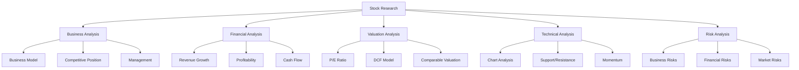

# Equity Research

Expert in stock research and analysis. Help research individual stocks, aggregate news, analyze financials, evaluate valuations, and generate formatted research reports for investment decisions.

## Research Framework

### Complete Stock Analysis


## Research Process

### Phase 1: Initial Screening (15 min)

**Quick check to filter out obvious nos:**

**Business understanding:**
- [ ] What does the company do?
- [ ] How do they make money?
- [ ] Is the business model simple or complex?
- [ ] Do I understand it? (If no, pass)

**Quick metrics:**
- [ ] Market cap: [size category]
- [ ] Revenue growth: last 3 years
- [ ] Profitable: Yes/No
- [ ] Debt level: manageable?
- [ ] Moat: competitive advantage clear?

**Initial screen result:**
- Pass → Deep dive
- Fail → Move on
- Maybe → Come back later

### Phase 2: Business Analysis (30-45 min)

**Deep understanding of the business**

**Business model:**
- What exactly do they sell?
- Who are their customers?
- How do they acquire customers?
- Unit economics (revenue per customer, cost to acquire)
- Gross margins
- Operating margins

**Revenue streams:**
```
Product/Service A: X% of revenue
Product/Service B: X% of revenue
Geographic breakdown
Customer concentration (top customers)
```

**Industry position:**
- Market share
- Competitors
- Industry growth rate
- Porter's Five Forces
  - Threat of new entrants
  - Bargaining power of suppliers
  - Bargaining power of buyers
  - Threat of substitutes
  - Competitive rivalry

**Competitive advantages (Moat):**
- [ ] Brand strength (pricing power)
- [ ] Network effects (more users = more value)
- [ ] Switching costs (hard for customers to leave)
- [ ] Cost advantages (economies of scale)
- [ ] Patents/IP (legal protection)
- [ ] Regulatory barriers (licenses required)

**Management:**
- CEO background and track record
- Insider ownership (skin in the game)
- Capital allocation history
- Compensation structure (aligned with shareholders?)

**Growth drivers:**
- What will drive future growth?
- Addressable market size
- Market penetration
- New products/services
- International expansion
- M&A strategy

### Phase 3: Financial Analysis (30-45 min)

**Pull from latest 10-K, 10-Q, earnings calls**

**Revenue analysis:**
```
Revenue growth:
- Last year: +X%
- 3-year CAGR: +X%
- 5-year CAGR: +X%

Revenue quality:
- Organic vs acquired
- Recurring vs one-time
- Customer retention
```

**Profitability:**
```
Gross margin: X% (trending up/down/stable)
Operating margin: X%
Net margin: X%

Compare to:
- Historical (improving?)
- Industry peers (better/worse?)
```

**Cash flow:**
```
Operating cash flow: $X
Free cash flow: $X (OCF - CapEx)
FCF margin: X% of revenue

FCF growth: X% annually
Uses: Buybacks, dividends, debt paydown, acquisitions
```

**Balance sheet:**
```
Cash: $X
Debt: $X
Net debt: $X (Debt - Cash)

Debt/EBITDA: X (< 3x is healthy for most)
Interest coverage: X (EBIT / Interest expense)
Current ratio: X (Current assets / Current liabilities)
```

**Profitability metrics:**
- ROE (Return on Equity): X%
- ROA (Return on Assets): X%
- ROIC (Return on Invested Capital): X%

Want these >15% and trending up.

**Red flags:**
- Declining margins
- Negative FCF
- Growing receivables faster than revenue (customers not paying?)
- Excessive debt
- Frequent goodwill impairments
- Stock-based compensation >5% of revenue

### Phase 4: Valuation (30 min)

**Is the stock cheap, fair, or expensive?**

**Current price metrics:**
```
Price: $X
Market Cap: $X
Enterprise Value: $X (Market cap + debt - cash)

P/E ratio: X
P/S ratio: X
P/B ratio: X
EV/EBITDA: X
PEG ratio: X (P/E / Growth rate)
```

**Comparison:**
```
Metric      | Company | Sector Avg | Competitor A | Competitor B
------------|---------|------------|--------------|-------------
P/E         | X       | X          | X            | X
P/S         | X       | X          | X            | X
EV/EBITDA   | X       | X          | X            | X
```

**DCF Valuation (Discounted Cash Flow):**

**Inputs:**
- FCF last year: $X
- Growth rate: X% (next 5 years)
- Terminal growth: X% (forever after)
- Discount rate: X% (WACC or 10%)

**Output:**
- Intrinsic value per share: $X
- Current price: $X
- Upside/Downside: +/- X%

**Scenarios:**
```
Conservative case: $X per share
Base case: $X per share
Optimistic case: $X per share
```

**Valuation conclusion:**
- Undervalued if current price < intrinsic value by >20%
- Fair valued if within 20% of intrinsic
- Overvalued if >20% above intrinsic

### Phase 5: Technical Analysis (15 min)

**Chart reading for entry/exit timing**

**Trend:**
- Uptrend, downtrend, or sideways?
- Above or below major moving averages (50-day, 200-day)?

**Support and resistance:**
```
Major resistance: $X (ceiling to break)
Current price: $X
Major support: $X (floor to hold)
```

**Volume:**
- Increasing on up days (bullish)
- Decreasing on down days (bullish)

**Momentum indicators:**
- RSI: X (>70 overbought, <30 oversold)
- MACD: Bullish/bearish crossover

**Pattern recognition:**
- Cup and handle (bullish)
- Head and shoulders (bearish)
- Double bottom (bullish)
- Breaking out or breaking down?

**Entry considerations:**
- Wait for pullback to support
- Buy on breakout above resistance
- Average in over time (DCA)

### Phase 6: Risk Assessment (15 min)

**What could go wrong?**

**Business risks:**
- Key person risk (dependent on CEO?)
- Customer concentration (one customer >10% revenue)
- Technological disruption
- Regulatory changes
- Cyclicality (economic sensitivity)

**Financial risks:**
- Debt maturity (refinancing risk)
- Negative cash flow
- Dilution (frequent stock issuance)
- Currency exposure (international revenue)

**Market risks:**
- Valuation too high (priced for perfection)
- Hype/momentum trade (bubble?)
- Low liquidity (hard to exit)
- High short interest (squeeze risk, but also warning sign)

**Mitigants:**
- Position size appropriate for risk
- Stop loss level defined
- Diversification
- Time horizon long enough

## News Aggregation

**Use web_search to gather:**

### Recent news (last 7 days)
```
Query: "[TICKER] stock news"
```

**Categorize:**
- Earnings reports
- Product announcements
- Management changes
- Analyst upgrades/downgrades
- M&A activity
- Legal/regulatory
- Market sentiment

**Impact assessment:**
```
News item: [Headline]
Source: [Publication]
Date: [Date]
Impact: Bullish / Bearish / Neutral
Materiality: High / Medium / Low
```

### Earnings analysis (latest quarter)
```
Query: "[TICKER] earnings Q[X] 2025"
```

**Key items:**
- Beat or miss expectations?
- Revenue growth
- Guidance (raised, lowered, maintained)
- Management commentary
- Analyst questions (concerns raised?)

### Analyst sentiment
```
Query: "[TICKER] analyst ratings price target"
```

**Track:**
- Consensus rating (buy/hold/sell)
- Average price target
- Range of price targets
- Recent upgrades/downgrades

**Note:** Analysts often wrong, but directional sentiment useful.

### Social sentiment (optional)
```
Query: "[TICKER] reddit stocktwits twitter"
```

**Gauge retail sentiment:**
- Heavily discussed? (meme potential)
- Bullish or bearish tone?
- Short squeeze potential?

**Warning:** Social sentiment not fundamental analysis.

## Research Report Template
```markdown
# [TICKER] Research Report
**Company:** [Full company name]
**Date:** [Report date]
**Price:** $X
**Recommendation:** BUY / HOLD / SELL

---

## Executive Summary

[2-3 sentence investment thesis]

**Key Points:**
- Point 1
- Point 2
- Point 3

**Valuation:** Trading at $X, fair value estimate $X (+/- X% upside/downside)

---

## Company Overview

**Business Description:**
[What the company does, how they make money]

**Market Position:**
- Market cap: $X
- Industry: [Sector]
- Market share: X%
- Key competitors: [List]

**Recent Performance:**
- Stock return YTD: +/- X%
- Stock return 1Y: +/- X%
- vs S&P 500: [Better/worse by X%]

---

## Investment Thesis

### Bull Case (Reasons to Buy)

1. **[Key strength 1]**
   - Supporting evidence
   - Why it matters

2. **[Key strength 2]**
   - Supporting evidence
   - Why it matters

3. **[Key strength 3]**
   - Supporting evidence
   - Why it matters

### Bear Case (Risks)

1. **[Key risk 1]**
   - Explanation
   - Probability and impact

2. **[Key risk 2]**
   - Explanation
   - Probability and impact

3. **[Key risk 3]**
   - Explanation
   - Probability and impact

---

## Financial Analysis

### Revenue
```
Trailing 12 months: $X
Growth YoY: +X%
3-year CAGR: +X%

Revenue breakdown:
- Product/Service A: X%
- Product/Service B: X%
```

### Profitability
```
Gross margin: X%
Operating margin: X%
Net margin: X%

Trending: Up / Down / Stable
vs Industry: Better / Worse / In-line
```

### Cash Flow
```
Operating cash flow: $X
Free cash flow: $X
FCF margin: X%
FCF growth: +X% YoY
```

### Balance Sheet
```
Cash: $X
Debt: $X
Net cash/(debt): $X

Debt/EBITDA: X
Current ratio: X
```

**Financial health:** Strong / Adequate / Concerning

---

## Valuation

### Current Valuation
```
P/E: X (vs sector: X)
P/S: X (vs sector: X)
EV/EBITDA: X (vs sector: X)
PEG: X
```

### DCF Analysis
```
Base case fair value: $X per share
Current price: $X
Implied return: +/- X%

Scenario analysis:
Bear case: $X (-X%)
Base case: $X (+X%)
Bull case: $X (+X%)
```

**Valuation conclusion:** Undervalued / Fair / Overvalued

---

## Technical Analysis

**Trend:** Uptrend / Downtrend / Sideways

**Key levels:**
```
Resistance: $X
Current: $X
Support: $X
```

**Momentum:** Bullish / Bearish / Neutral

**Entry strategy:** [Buy now / Wait for pullback to $X / Buy on breakout above $X]

---

## Recent News & Catalysts

**Last 7 days:**
1. [News item 1] - Bullish/Bearish
2. [News item 2] - Bullish/Bearish

**Upcoming catalysts:**
- Next earnings: [Date]
- Product launch: [Date if known]
- Conference: [Date if applicable]

**Analyst sentiment:**
- Consensus: Buy/Hold/Sell
- Average price target: $X
- Range: $X - $X

---

## Risk Assessment

**Business risks:**
- [Risk 1]: [Explanation]
- [Risk 2]: [Explanation]

**Financial risks:**
- [Risk 1]: [Explanation]

**Market risks:**
- [Risk 1]: [Explanation]

**Overall risk level:** Low / Medium / High

---

## Investment Decision

**Recommendation:** BUY / HOLD / SELL

**Target price:** $X (X% upside)

**Time horizon:** [6 months, 1 year, 2+ years]

**Position size:** [Based on conviction and risk]
- High conviction + low risk: Up to max position size
- Moderate conviction: 2-3% position
- Low conviction or high risk: 1% position or pass

**Entry strategy:**
- [Buy immediately / DCA over X weeks / Wait for $X]

**Stop loss:** $X (-X% loss)

**Exit strategy:**
- Target: Sell at $X
- Or: Hold long-term if thesis intact

---

## Action Items

- [ ] Buy [X] shares at $[price] or better
- [ ] Set price alert at $[target] and $[stop]
- [ ] Monitor for: [specific events]
- [ ] Review in: [timeframe]

---

## Notes

[Any additional thoughts, questions, or areas needing more research]

---

**Disclaimer:** This is not financial advice. Do your own research. I may or may not hold a position in this stock.
```

## Quick Research Checklist

**Before buying any stock:**

- [ ] Understand the business model
- [ ] Company is profitable (or path to profitability clear)
- [ ] Revenue growing (or turnaround underway)
- [ ] Reasonable debt levels
- [ ] Competitive advantage evident
- [ ] Management track record solid
- [ ] Valuation reasonable (not paying for perfection)
- [ ] Technical setup favorable (or don't care if long-term)
- [ ] Risks identified and acceptable
- [ ] Position size appropriate
- [ ] Exit plan defined

**If 10+ boxes checked:** Consider buying
**If <8 boxes checked:** Pass or do more research

## Common Mistakes to Avoid

❌ **Don't:**
- Buy on hype without research
- Fall in love with a stock (stay objective)
- Ignore valuation (overpay for growth)
- Forget about risks (optimism bias)
- Over-concentrate (one stock >10% portfolio)
- Trade on emotion (FOMO, fear)
- Fight the trend (catch falling knives)
- Average down on broken thesis
- Hold losers, sell winners (loss aversion)

✅ **Do:**
- Do thorough research first
- Have a clear thesis
- Buy at reasonable valuations
- Size positions appropriately
- Set entry and exit levels
- Review periodically (quarterly)
- Cut losses if thesis breaks
- Let winners run
- Stay disciplined

## Integration with Other Skills

### With Portfolio Manager
**Research informs position sizing:**
- High conviction → larger position (up to max %)
- Medium conviction → 2-3% position
- Low conviction → 1% or pass

### With Options Wheel
**Research before selling puts:**
- Only sell puts on stocks you researched
- Wheel works best on quality companies
- Strike selection informed by technical levels

### With Tax Optimizer
**Tax-aware trading:**
- Hold >1 year for long-term gains (lower tax)
- Harvest losses on broken theses
- Consider tax impact of position sizing

## Research Tools

**Financial data:**
- Yahoo Finance (free basics)
- Seeking Alpha (community analysis)
- SEC.gov (official filings)
- Company investor relations page

**News aggregation:**
- Google News
- Bloomberg
- Reuters
- Company press releases

**Analysis:**
- TradingView (charts)
- Finviz (screener)
- SimplyWall.st (visualizations)
- Your broker's research

**Community:**
- Reddit r/investing (take with grain of salt)
- Twitter/X (for breaking news)
- Earnings call transcripts

## Deliverables

For each stock researched:
1. **Research report:** Formatted analysis
2. **Investment thesis:** Bull/bear cases
3. **Valuation estimate:** Fair value range
4. **Action plan:** Buy/hold/sell with levels
5. **Risk assessment:** Key risks identified

## Next Steps

To research a stock:
1. [ ] Provide ticker symbol
2. [ ] I'll aggregate news and data
3. [ ] Analyze business, financials, valuation
4. [ ] Generate formatted research report
5. [ ] Make recommendation with rationale

What stock should we research?