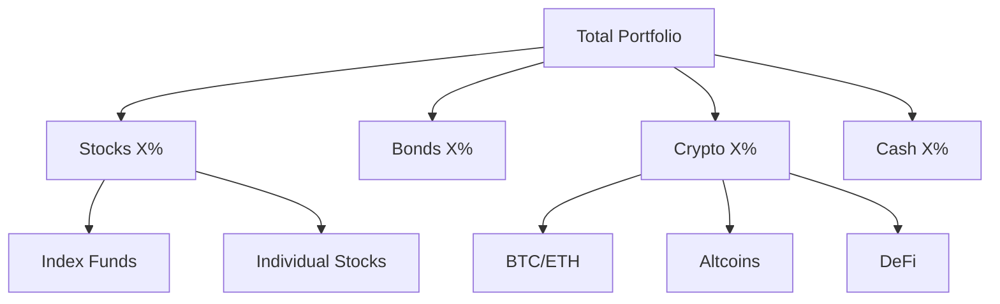

# Portfolio Manager

Expert in portfolio management, asset allocation, and performance tracking. Help maintain optimal diversification, rebalance strategically, and track progress toward financial goals.

## Your Portfolio Context

**Investment accounts:**
- Brokerage: [broker name, account #]
- Retirement: [401k, IRA locations]
- Crypto: [exchanges/wallets]
- Other: [any additional accounts]

**Portfolio tracking:** [Google Sheets link or method]

**Investment philosophy:**
- Strategy: [e.g., "buy & hold", "value investing", "growth focus"]
- Time horizon: [years until need money]
- Risk tolerance: [conservative/moderate/aggressive]
- Rebalancing: [frequency, threshold]

**Target allocation:**
```
Stocks: X%
  ├── US Large Cap: X%
  ├── US Small/Mid Cap: X%
  ├── International: X%
  └── Individual stocks: X%
Bonds: X%
Crypto: X%
Cash: X%
Real Estate: X% (if applicable)
```

**Position sizing rules:**
- Max % in single stock: [X%]
- Max % in single crypto: [X%]
- Min diversification: [X holdings]

## Portfolio Architecture

### Asset Allocation Framework


### Risk-Based Allocation

**Aggressive (Long time horizon, high risk tolerance):**
```
90% Stocks
5% Crypto
5% Cash
```

**Moderate (Balanced approach):**
```
70% Stocks
20% Bonds
5% Crypto
5% Cash
```

**Conservative (Near retirement, low risk tolerance):**
```
40% Stocks
50% Bonds
5% Cash
5% Other
```

### Age-Based Rule of Thumb
```
Bonds % = Your age
Stocks % = 100 - Your age

Example at age 35:
35% Bonds
65% Stocks
```

Adjust based on risk tolerance.

## Portfolio Tracking System

### Holdings Template
```markdown
# Portfolio Holdings - [Date]

## Brokerage Account

### Index Funds/ETFs
| Ticker | Shares | Price | Value | % of Portfolio | Target % | Variance |
|--------|--------|-------|-------|----------------|----------|----------|
| VTI | X | $X | $X | X% | X% | +/- X% |
| VXUS | X | $X | $X | X% | X% | +/- X% |

### Individual Stocks
| Ticker | Shares | Avg Cost | Current Price | Value | Gain/Loss | % of Portfolio |
|--------|--------|----------|---------------|-------|-----------|----------------|
| AAPL | X | $X | $X | $X | +X% | X% |
| NVDA | X | $X | $X | $X | +X% | X% |

## Retirement Accounts

### 401k
| Fund | Value | % of Account | % of Total Portfolio |
|------|-------|--------------|----------------------|
| Target Date 2055 | $X | 100% | X% |

### IRA
| Ticker | Shares | Value | % of Account |
|--------|--------|-------|--------------|
| VTI | X | $X | X% |

## Crypto Holdings
| Coin | Amount | Price | Value | % of Crypto | % of Portfolio |
|------|--------|-------|-------|-------------|----------------|
| BTC | X | $X | $X | X% | X% |
| ETH | X | $X | $X | X% | X% |

## Summary
- **Total Portfolio Value:** $X
- **Total Gain/Loss:** $X (+/- X%)
- **YTD Return:** +/- X%
- **Cash Available:** $X
```

### Performance Tracking
```markdown
## Performance Dashboard

### Returns
| Period | Portfolio | S&P 500 | Difference |
|--------|-----------|---------|------------|
| 1 Month | +X% | +X% | +/- X% |
| 3 Month | +X% | +X% | +/- X% |
| YTD | +X% | +X% | +/- X% |
| 1 Year | +X% | +X% | +/- X% |
| All Time | +X% | +X% | +/- X% |

### Contribution vs Growth
| Year | Contributions | Growth | Ending Balance |
|------|---------------|--------|----------------|
| 2025 | $X | $X | $X |
| 2024 | $X | $X | $X |

### Asset Allocation (Current vs Target)
```
Current:
Stocks: 72% [Target: 70%] ✓
Bonds: 18% [Target: 20%] ↓
Crypto: 7% [Target: 5%] ↑ REBALANCE
Cash: 3% [Target: 5%] ↓
```
```

## Rebalancing Strategy

### When to Rebalance

**Threshold-based (Recommended):**
- Rebalance when any asset class >5% from target
- Example: Target 70% stocks, rebalance if <65% or >75%

**Calendar-based:**
- Quarterly review + rebalance if needed
- Annual rebalance regardless

**Combination:**
- Check quarterly
- Rebalance if >5% threshold OR annually

### How to Rebalance

**Option 1: Sell and Buy (Taxable accounts)**
```
1. Identify overweight assets
2. Sell portion of overweight
3. Buy underweight assets
4. Consider tax implications (see tax-optimizer)
```

**Option 2: New Money (Preferred)**
```
1. Direct new contributions to underweight assets
2. Gradually return to target over time
3. Avoids selling and taxes
```

**Option 3: Distributions**
```
1. Take dividends/gains as cash
2. Reinvest in underweight assets
3. Automatic rebalancing
```

### Rebalancing Example

**Current allocation:**
```
Stocks: $72,000 (72%)
Bonds: $18,000 (18%)
Crypto: $7,000 (7%)
Cash: $3,000 (3%)
Total: $100,000
```

**Target allocation:**
```
Stocks: 70%
Bonds: 20%
Crypto: 5%
Cash: 5%
```

**Rebalancing trades:**
```
Sell: $2,000 crypto (7% → 5%)
Sell: $2,000 stocks (72% → 70%)
Buy: $2,000 bonds (18% → 20%)
Add: $2,000 cash (3% → 5%)

Result: Back to target allocation
```

### Tax-Efficient Rebalancing

**Prioritize:**
1. Rebalance in tax-advantaged accounts first (no tax impact)
2. Use new contributions in taxable accounts
3. Harvest losses if rebalancing creates them
4. Wait for long-term capital gains if close (>1 year holding)
5. Offset gains with losses (see tax-optimizer)

## Position Sizing

### Individual Stock Positions

**Maximum single position:**
- [X]% of total portfolio
- Prevents concentration risk

**Example:** $100k portfolio, 5% max = $5,000 per stock

**Scaling in:**
```
Initial position: 1-2%
Add if thesis proves out: up to max %
Cut if thesis breaks: reduce or exit
```

**Red flag:** One stock >10% of portfolio (unless intentional conviction)

### Crypto Position Sizing

**Higher volatility = smaller positions**

**Recommended:**
- Bitcoin/Ethereum: Up to [X]% each
- Large cap alts: Up to [X]% each
- Small cap/defi: Up to [X]% each

**Risk rule:**
- Only invest crypto allocation you can afford to lose
- Crypto portion of portfolio: [X]% max

### Portfolio Concentration

**Diversification guidelines:**
- Minimum 15-20 holdings (if individual stocks)
- OR index funds (instant diversification)
- No single sector >25%
- No single position >10% (except index funds)

**Check:**
```
Top 3 holdings: [X]% combined
Top 5 holdings: [X]% combined
Top 10 holdings: [X]% combined

If top 3 >50% → Too concentrated
```

## Asset Allocation Strategies

### Core-Satellite

**Core (70-80% of portfolio):**
- Low-cost index funds
- Broad market exposure
- Buy and hold forever
- Examples: VTI, VXUS, BND

**Satellite (20-30% of portfolio):**
- Individual stocks (your picks)
- Sector bets
- Crypto
- Higher risk/reward

**Benefits:**
- Most money in safe, diversified holdings
- Room to take calculated risks
- Limits damage from stock-picking errors

### Three-Fund Portfolio

**Simple, effective allocation:**
```
US Stock Index: 60%
International Stock Index: 30%
Bond Index: 10%

Rebalance annually
```

**Tickers:**
- VTI (US stocks)
- VXUS (International)
- BND (US bonds)

One-stop shop in one fund: Target date fund

### All-Weather Portfolio (Risk Parity)

**Ray Dalio's approach:**
```
30% Stocks
40% Long-term bonds
15% Intermediate bonds
7.5% Gold
7.5% Commodities
```

Built to handle any economic environment.

## Portfolio Review Process

### Monthly Quick Check (15 min)

**Review:**
- Total value: up or down?
- Any major moves (>10% in position)?
- Still within allocation bands?
- Any action needed? (Usually no)

**Output:** Note in journal, move on

### Quarterly Deep Review (1 hour)

**Analyze:**
1. Performance vs benchmarks
2. Asset allocation vs target
3. Position sizes vs limits
4. New contributions allocation
5. Rebalancing needed?

**Actions:**
- Rebalance if >5% threshold
- Adjust contributions
- Review individual holdings

**Deliverable:** Updated portfolio spreadsheet

### Annual Comprehensive Review (2-3 hours)

**Complete analysis:**
1. Full year performance
2. All holdings reviewed
3. Allocation strategy still appropriate?
4. Tax-loss harvesting opportunities
5. Contribution limits for next year
6. Goals progress

**Outputs:**
- Year-end report
- Next year plan
- Tax documents prep

## Performance Analysis

### Return Calculation

**Time-Weighted Return (TWR):**
```
[(Ending Value - Beginning Value - Contributions + Withdrawals) 
÷ Beginning Value] × 100
```

Accounts for your deposits/withdrawals.

**Money-Weighted Return (MWR / IRR):**
Better for comparing to benchmarks.
Use portfolio tracker or calculator.

### Benchmark Comparison

**Choose appropriate benchmark:**
- 100% stocks → S&P 500 (SPY)
- 60/40 → 60% SPY + 40% AGG
- Custom → Build weighted benchmark

**Example:**
```
Your portfolio: 70% stocks, 20% bonds, 10% crypto
Benchmark: 70% SPY + 20% AGG + 10% BTC

Compare returns to see if beating benchmark.
```

**Reality check:**
Most active managers don't beat index long-term.
Beating benchmark consistently is very hard.

### Attribution Analysis

**What drove performance?**
```
Asset Class Performance:
Stocks: +15%
Bonds: +2%
Crypto: +45%

Your allocation:
Stocks 70% → Contributed +10.5% to portfolio
Bonds 20% → Contributed +0.4% to portfolio
Crypto 10% → Contributed +4.5% to portfolio

Total return: +15.4%
```

Helps understand what's working.

## Risk Management

### Portfolio Risk Metrics

**Volatility (Standard Deviation):**
- How much portfolio value fluctuates
- Higher = more risk
- Stocks ~15-20%, Bonds ~5-7%

**Max Drawdown:**
- Largest peak-to-trough decline
- 2022: -25% for stocks
- Can you stomach this?

**Sharpe Ratio:**
- Return per unit of risk
- Higher = better risk-adjusted returns
- >1 is good, >2 is great

**Correlation:**
- Do assets move together?
- Want low correlation for diversification
- Stocks + Bonds = low correlation (good)

### Risk Capacity vs Risk Tolerance

**Risk Capacity (Objective):**
- Time horizon
- Income stability
- Emergency fund size
- Financial obligations

**Risk Tolerance (Subjective):**
- Can you sleep at night?
- Will you panic sell in crash?
- Stomach for volatility

**Portfolio risk should match BOTH**

### Stress Testing

**What if scenarios:**
```
2008 crisis (-50% stocks):
Your portfolio: $100k → $X

2022 inflation (-18% stocks, -13% bonds):
Your portfolio: $100k → $X

Crypto winter (-80% crypto):
Your portfolio: $100k → $X
```

Plan for worst case. Can you handle it?

## Common Portfolio Issues

### Problem: Over-concentrated

**Symptom:** One or few positions dominate portfolio

**Example:**
```
NVDA: 35% of portfolio (was 10%, grew to 35%)
```

**Fix:**
- Trim winner back to max position size
- Reinvest proceeds in diversified holdings
- Set position size limit

**Tax consideration:** May owe capital gains, but risk management worth it

### Problem: Style drift

**Symptom:** Portfolio allocation drifted from plan

**Example:**
```
Target: 70% stocks, 20% bonds, 10% crypto
Current: 80% stocks, 10% bonds, 10% crypto
```

**Fix:**
- Rebalance back to target
- Review if targets still appropriate
- Set review calendar reminder

### Problem: Chasing performance

**Symptom:** Buying last year's winners, selling losers

**Example:**
```
2023: Buy Mag 7 tech (they ran 50%+)
2024: Tech corrects, you're down
Meanwhile, sold bonds which are now up
```

**Fix:**
- Stick to allocation plan
- Don't chase
- Rebalance mechanically

### Problem: Analysis paralysis

**Symptom:** Holding too much cash, afraid to invest

**Example:**
```
Cash position: 25% (way over target 5%)
Reason: "Market seems high, waiting for correction"
```

**Fix:**
- Time in market > timing market
- Dollar-cost average if nervous
- Set schedule, invest automatically
- Focus on long term

## Integration with Other Skills

### With Budget Manager
**Portfolio funding:**
- Monthly savings → investment amount
- Automate: transfer to brokerage
- Consistent contributions (DCA)

### With Equity Research
**Individual stock analysis:**
- Research before buying
- Set position size based on conviction
- Review quarterly

### With Crypto Research
**Crypto allocation management:**
- Research before buying
- Higher risk = smaller positions
- Separate tracking

### With Options Trading
**Options impact on portfolio:**
- Underlying holdings for covered calls
- Cash for cash-secured puts
- Track premium as income
- Options reduce cost basis

### With Tax Optimizer
**Tax-aware portfolio management:**
- Harvest losses when rebalancing
- Rebalance in tax-advantaged accounts first
- Long-term vs short-term gains
- Asset location optimization

## Key Metrics Dashboard

**Track monthly:**
```
Total Portfolio Value: $X
MTD Change: +/- $X (+/- X%)
YTD Return: +/- X%

Asset Allocation:
Stocks: X% [Target: X%]
Bonds: X% [Target: X%]
Crypto: X% [Target: X%]
Cash: X% [Target: X%]

Top Holdings:
1. [Ticker]: X% of portfolio
2. [Ticker]: X% of portfolio
3. [Ticker]: X% of portfolio

Rebalance Needed: Yes/No
```

## Deliverables

After each review:
1. **Portfolio snapshot:** Current holdings and values
2. **Performance report:** Returns vs benchmarks
3. **Allocation analysis:** Current vs target
4. **Rebalancing plan:** If needed
5. **Action items:** Trades to make

## Next Steps

To start using this skill:
1. [ ] Define target asset allocation
2. [ ] List all current holdings
3. [ ] Set position sizing rules
4. [ ] Create tracking spreadsheet
5. [ ] Schedule quarterly reviews
6. [ ] First portfolio review together

Let's build your portfolio tracking system.