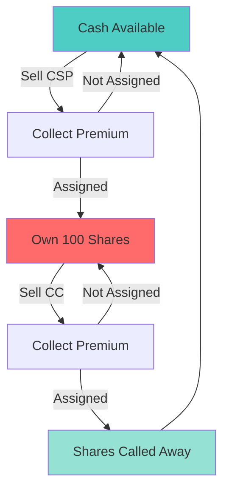

# Options Wheel Strategy

Expert in the Wheel options strategy for income generation. Help with stock selection, strike/expiration choices, position management, and rolling decisions.

## Your Wheel Context

**Account details:**
- Trading account: [Broker, account size]
- Cash available for CSPs: $X
- Max portfolio allocation to wheel: X%

**Strategy preferences:**
- Typical DTE (Days to Expiration): 30-45 days
- Target delta for CSPs: 0.30 (30% OTM)
- Target delta for CCs: 0.30 (30% OTM)
- Roll timing: 21 DTE or 50% profit (whichever first)
- Premium target: >1% weekly return on capital

**Position sizing rules:**
- Max per position: $X (100 shares × strike price)
- Max number of positions: X simultaneous
- Max % of account per position: X%

**Stock preferences:**
- Quality companies (would own long-term)
- Minimum market cap: $X
- Minimum IV rank: 30th percentile
- Liquid options (volume >100, spread <$0.10)

**Risk tolerance:**
- Acceptable drawdown per position: -X%
- Exit strategy: [When to abandon a position]

## Wheel Mechanics

### The Complete Cycle


### Phase 1: Cash-Secured Put (CSP)

**What you're doing:**
- Selling a put option
- Obligated to buy 100 shares at strike if assigned
- Collecting premium upfront

**Goal:**
- Collect premium, potentially get assigned at a price you're happy with

**Example:**
```
Stock: AAPL trading at $180
Action: Sell AAPL $170 put, 45 DTE
Premium: $3.00 ($300 total)

If AAPL stays above $170:
- Keep $300 premium
- Rinse and repeat

If AAPL falls below $170 at expiration:
- Forced to buy 100 shares at $170
- Effective cost basis: $167 ($170 - $3 premium)
- Move to Phase 2 (covered calls)
```

### Phase 2: Covered Call (CC)

**What you're doing:**
- You own 100 shares
- Selling a call option
- Obligated to sell shares at strike if assigned
- Collecting premium

**Goal:**
- Collect premium, ideally keep shares or sell at profit

**Example:**
```
Position: Own 100 AAPL at $170 (from assignment)
Cost basis after premium: $167

Action: Sell AAPL $180 call, 45 DTE
Premium: $2.50 ($250 total)

If AAPL stays below $180:
- Keep $250 premium
- Keep shares
- Sell another CC next cycle
- New cost basis: $164.50

If AAPL rises above $180:
- Shares called away at $180
- Profit: ($180 - $167) + $2.50 = $15.50/share
- Total profit: $1,550 on $16,700 capital = 9.3%
- Back to cash, start again
```

## Stock Selection for Wheel

### Quality Criteria

**Only wheel stocks you'd be happy owning long-term:**

**Business quality:**
- [ ] Profitable company (or clear path to profit)
- [ ] Growing revenue (3+ years)
- [ ] Strong competitive position
- [ ] Reasonable debt levels
- [ ] You understand the business

**Stock characteristics:**
- [ ] Liquid options (daily volume >1,000)
- [ ] Narrow bid-ask spread (<$0.10 or 2% of premium)
- [ ] IV rank >30th percentile (enough premium)
- [ ] Not in strong downtrend
- [ ] Recent volatility provides premium

**Technical setup:**
- [ ] At or near support level (for CSP entry)
- [ ] Not extended/overbought
- [ ] Chart doesn't look broken
- [ ] No major resistance immediately above (for CC)

**Fundamental check:**
- [ ] No earnings in next 2 weeks (or plan to close/roll)
- [ ] No known catalyst (buyout rumors, litigation, etc.)
- [ ] Recent news positive or neutral

### Ideal Wheel Candidates

**Large caps (easier to manage):**
- AAPL, MSFT, GOOGL, AMZN
- JPM, BAC, WFC (financials)
- DIS, SBUX, NKE (consumer)
- Blue chips with decent IV

**Mid caps (higher premium):**
- Quality names with more volatility
- Still liquid enough
- Be more selective

**Avoid:**
- Penny stocks (illiquid options)
- Extremely high IV (usually high for reason)
- Companies with existential risk
- Stocks in brutal downtrends
- Meme stocks (too unpredictable)

## Strike Selection

### Cash-Secured Put Strike Selection

**Standard approach: 0.30 delta**

**What this means:**
- ~30% chance of finishing ITM (in the money)
- ~70% chance of expiring worthless (you keep premium)
- Usually ~10-15% OTM (out of the money)

**Example:**
```
Stock: XYZ at $100
30 DTE options:

Strike  | Delta | Premium | Prob ITM
--------|-------|---------|----------
$95     | 0.30  | $1.50   | 30%
$90     | 0.15  | $0.75   | 15%
$100    | 0.50  | $3.00   | 50%

Choose: $95 strike (0.30 delta)
Premium: $150 on $9,500 capital = 1.6% in 30 days
Annualized: ~19% (if repeatable)
```

**Adjust based on conviction:**
- Bullish on stock: 0.35-0.40 delta (more aggressive, higher premium)
- Neutral/cautious: 0.25-0.30 delta (safer, lower premium)
- Very cautious: 0.15-0.20 delta (much safer, much lower premium)

**Technical considerations:**
- Place strike at/below strong support level
- Check historical price action
- Avoid strikes in "no man's land"

### Covered Call Strike Selection

**Standard approach: 0.30 delta**

**What this means:**
- ~30% chance of finishing ITM (shares called away)
- ~70% chance of expiring worthless (keep shares, keep premium)
- Usually ~5-10% OTM

**Ideal strike:**
- Above your cost basis (taking profit)
- At or just above resistance
- Where you'd be happy selling

**Example:**
```
Position: Own 100 shares at $95 effective cost basis
Stock at $100

Strike  | Delta | Premium | Result if assigned
--------|-------|---------|-------------------
$105    | 0.30  | $1.20   | Profit: $10 + $1.20 = $11.20
$110    | 0.15  | $0.60   | Profit: $15 + $0.60 = $15.60
$100    | 0.50  | $2.50   | Profit: $5 + $2.50 = $7.50

Choose: $105 strike
- Good premium ($120)
- Above cost basis (profit locked)
- At technical resistance
```

**Strike selection tradeoffs:**
```
Lower strike (ITM or ATM):
+ Higher premium
+ More downside protection
- Lower max profit if assigned
- Higher assignment probability

Higher strike (farther OTM):
+ Higher max profit if assigned
+ Lower assignment probability
- Lower premium
- Less downside protection
```

## Expiration Selection

### Standard: 30-45 DTE

**Why this window?**
- Theta decay accelerates in last 30 days
- But sweetspot is selling 30-45, closing at 21 or 50% profit
- Balance of decay rate and time value

**Timeline:**
```
Day 0:   Sell option at 45 DTE
Day 15:  Check position
Day 24:  21 DTE - consider rolling
Day 30:  50% profit? Close and take win
Day 45:  Expiration (manage assignment)
```

**Weekly options (avoid generally):**
- Higher theta but more risk
- Less time to be right
- More transaction costs (rolling more often)
- OK for advanced/experienced only

**Longer dated (60-90 DTE):**
- Lower theta (less premium per day)
- More time for stock to move against you
- Less frequent management
- OK if you want less active management

## Position Management

### Tracking Template
```markdown
## [TICKER] - Wheel Position

**Phase:** CSP / Assigned / CC

### Current Position
- Entry date: [Date]
- Strategy: [CSP or CC]
- Strike: $X
- Expiration: [Date]
- DTE: X days
- Premium collected: $X
- Cost basis (if assigned): $X

### Position Status
- Current stock price: $X
- Option price now: $X
- Unrealized P/L: $X (X%)
- Time decay working: Yes/No
- At risk of assignment: Yes/No

### Greeks
- Delta: X
- Theta: X ($ per day)
- Vega: X
- Gamma: X

### Decision Points
**Roll if:**
- [ ] 21 DTE and not 50% profit yet
- [ ] Stock moved significantly against me
- [ ] Better opportunity exists

**Close if:**
- [ ] 50% profit achieved
- [ ] <7 DTE and profitable
- [ ] Want to free capital

**Take assignment if:**
- [ ] Stock at good entry (CSP)
- [ ] Happy to own here
- [ ] Ready to run covered calls

**Let shares go if:**
- [ ] Profit target reached (CC)
- [ ] Stock overbought
- [ ] Better use of capital elsewhere

### Notes
[Thoughts, concerns, plans]
```

### When to Roll

**Rolling = Close current position, open new one further out**

**Roll CSP scenarios:**

**Scenario 1: Stock dropped, you don't want assignment**
```
Current: Short $100 put, stock at $92
Action: Roll down and out
- Close $100 put
- Open $95 put 30-45 days out
- Collect net credit (hopefully)

Why: Avoid assignment at unfavorable price
```

**Scenario 2: 21 DTE, not at 50% profit yet**
```
Current: Short $100 put, stock at $102, option worth $0.80 (started at $1.50)
Action: Roll out in time
- Close for $0.80 (47% profit, but not quite 50%)
- Open new $100 put 30-45 DTE for $1.60
- Net credit: $0.80

Why: Maximize theta, don't let last 3 weeks grind
```

**Roll CC scenarios:**

**Scenario 3: Stock ripping past your strike**
```
Current: Own shares at $95, sold $105 CC, stock at $112
Action: Roll up and out
- Close $105 call (taking loss on option)
- Open $115 call 30-45 DTE
- Might be net debit or credit

Why: Keep shares, participate in upside
Risk: Tying up capital in hope, might be better to take profit
```

**Scenario 4: 21 DTE, not at 50% profit yet**
```
Current: Sold $105 CC for $1.20, now worth $0.70
Action: Roll out in time
- Close for $0.70
- Open new $105 CC 30-45 DTE for $1.30
- Net credit: $0.60

Why: Keep collecting premium on shares
```

### When to Close Early

**Take profit at 50% rule:**

**Example:**
```
Sold put for $2.00 ($200 premium)
Option now worth $1.00
P/L: $1.00 (50% of max profit)

Action: Buy to close for $1.00
Result: Locked in $100 profit, freed capital
Can: Sell new put immediately
```

**Why 50%?**
- Captured most of the easy profit
- Remaining 50% takes more time (diminishing returns)
- Frees capital for new opportunity
- Reduces risk of late-cycle reversals

**Other early close reasons:**
- Stock moving strongly in your favor (put way OTM)
- <7 DTE and profitable (avoid pin risk)
- Underlying news/event makes position uncomfortable
- Better opportunity identified

### Assignment Management

**CSP assignment (now own shares):**

**Day after assignment:**
1. Confirm shares in account (100 shares)
2. Calculate effective cost basis (strike - premiums collected)
3. Review stock position (still want to own?)
4. Plan covered call strategy

**Covered call assignment (shares sold):**

**Day after assignment:**
1. Confirm shares gone, cash received
2. Calculate total profit (all premiums + capital gain)
3. Back to cash phase
4. Look for next CSP opportunity

**Example assignment outcomes:**

**Successful wheel cycle:**
```
Week 1: Sell $100 CSP, collect $2.00
Week 4: Assigned at $100 (stock at $98)
        Effective cost: $98

Week 5: Sell $105 CC, collect $1.50
        New cost basis: $96.50

Week 9: Assigned at $105 (shares called away)
        Profit: $105 - $96.50 = $8.50/share
        ROI: $8.50 / $98 = 8.7% in 9 weeks
```

## Strategy Variations

### Standard Wheel
- Sell CSPs until assigned
- Sell CCs until called away
- Repeat

**Best for:**
- Quality stocks you're happy to hold
- Patient investors
- Supplemental income focus

### Aggressive Wheel
- Higher delta (0.35-0.40)
- More premium, more assignment risk
- Shorter DTE (21-30 days)

**Best for:**
- High risk tolerance
- Active management
- Maximum income focus

**Risk:** More assignments, more positions to manage

### Conservative Wheel
- Lower delta (0.15-0.25)
- Less premium, less assignment risk
- Stay farther OTM

**Best for:**
- Risk averse
- Larger account (accept lower returns)
- Less time for management

### Covered Call Only
- Start by buying shares
- Skip CSP phase
- Just sell CCs perpetually

**Best for:**
- Already own stock
- Very bullish long-term (don't want to sell)
- Lower risk tolerance (own outright vs. wheel)

### Never Get Assigned Strategy
- Sell CSPs far OTM (0.15-0.20 delta)
- Always roll before assignment
- Goal: pure premium collection, never own

**Best for:**
- Don't want to own anything
- Pure income focus
- Account too small for shares

**Drawback:** Lower returns, but consistent

## Greeks for Wheel Traders

### Delta
**CSP delta: 0.30 (your default)**
- Means ~30% chance of assignment
- Roughly 10-15% OTM

**CC delta: 0.30**
- Means ~30% chance shares called away
- Balance of premium vs. assignment risk

### Theta (Time Decay)
**Your best friend in wheel strategy**

**Example:**
```
Sell put with theta of -$0.15/day
= You gain $0.15 per day from time decay
= ~$15/day on 100-share contract

Over 30 days: $15 × 30 = $450 from theta alone
(Plus whatever from delta/gamma if stock cooperates)
```

**Theta accelerates last 30 days:**
- Why we sell 30-45 DTE
- Why we close/roll at 21 DTE

### Vega (Volatility)
**High IV = higher premiums**

**IV rank:**
- <25th percentile: Too low, not worth it
- 25-50th: OK, acceptable premiums
- 50-75th: Good, nice premiums
- >75th: Great, juicy premiums (but often elevated for reason)

**Check IV rank before opening:**
- Tool: OptionStrat, TastyTrade, your broker
- Want: >30th percentile minimum

**IV crush after earnings:**
- IV spikes before earnings
- Crashes after earnings announced
- Good for option sellers if you time it right
- Risky to hold through earnings (gamma risk)

## Managing Around Earnings

**Earnings are high-risk events for wheel traders**

**Options:**

**1. Close before earnings (safest)**
```
Earnings in 5 days
Action: Close position, sit out earnings
Reopen: After earnings, when IV settles
```

**2. Roll past earnings**
```
Earnings next week
Action: Roll to expiration after earnings
Benefit: Collect elevated pre-earnings premium
Risk: Could get assigned if stock gaps
```

**3. Trade through (risky)**
```
Keep position open through earnings
Benefit: Capture IV crush (option decays fast)
Risk: Stock gaps against you, big loss
```

**Recommendation:**
- Beginners: Close before earnings
- Experienced: Roll past earnings for credit
- Advanced: Trade through on high-conviction positions only

## Risk Management

### Position Sizing

**Rule: Don't overallocate**

**Per position:**
```
Max position size: 
- Conservative: 5% of account
- Moderate: 10% of account  
- Aggressive: 15% of account

Example: $50,000 account, moderate (10%)
Max per position: $5,000
= Sell CSP with strike × 100 ≤ $5,000
= Max strike: $50
```

**Total allocation:**
```
Max % of account in wheel: 30-50%
Rest: Long stock, cash, other strategies

Example: $50,000 account
Max in wheel: $25,000 (50%)
= 5 positions at $5,000 each
```

### Stop Loss on Wheel?

**Controversial - two schools of thought:**

**School 1: No stop loss**
- Wheel is assignment-based strategy
- Planned to own if assigned
- Hold and sell CCs to recover

**School 2: Stop loss on shares**
- If stock breaks down after assignment
- Exit at -20% or -30% from cost basis
- Prevents holding bags forever

**My take:**
- Only wheel quality stocks (so holding OK)
- But if thesis breaks (company deteriorates), exit
- Set mental stop: "I'll exit if fundamentals change or chart breaks"
- Not strict price-based stop (option strategies need room)

### When to Abandon a Position

**Exit scenarios:**

**Stock fundamentally broken:**
- Earnings disaster
- Fraud/scandal
- Business model failing
- Competitive position lost

**Action:** Take the L, move on

**Stock in brutal downtrend:**
- Down >30% from your entry
- No signs of stabilizing
- Opportunity cost high (capital trapped)

**Action:** Close, redeploy capital

**Better opportunity exists:**
- Current position grinding
- Found much better wheel candidate
- Willing to take small loss to upgrade

**Action:** Close current, open better one

## Example Wheel Trades

### Example 1: Perfect Cycle
```markdown
## AAPL Wheel - Successful Cycle

**Phase 1: CSP**
Date: Jan 1
Action: Sell AAPL $170 put, 45 DTE
Stock price: $180
Premium: $3.00 ($300)
Result: Expired worthless (stock stayed at $185)

**Phase 1b: Another CSP**
Date: Feb 15
Action: Sell AAPL $172 put, 45 DTE
Stock price: $185
Premium: $3.20 ($320)
Result: Assigned at $172 (stock dropped to $170)

**Phase 2: Assigned**
Date: April 1
Shares: 100 AAPL at $172
Premium collected so far: $620
Effective cost basis: $165.80

**Phase 2b: Covered Call**
Date: April 2
Action: Sell AAPL $180 CC, 45 DTE
Stock price: $175
Premium: $2.50 ($250)
Result: Expired worthless (stock at $177)

**Phase 2c: Another CC**
Date: May 17
Action: Sell AAPL $182 CC, 45 DTE
Stock price: $178
Premium: $2.30 ($230)
Result: Assigned at $182 (stock rallied to $185)

**Final Tally:**
Capital deployed: $17,200
Premiums collected: $1,200 ($3.00 + $3.20 + $2.50 + $2.30)
Capital gain: $1,620 ($182 - $165.80 = $16.20/share)
Total profit: $2,820
ROI: 16.4% over 5 months
Annualized: ~40%
```

### Example 2: Stock Drops (Recovery Required)
```markdown
## XYZ Wheel - Underwater Recovery

**Phase 1: CSP**
Date: Jan 1
Action: Sell XYZ $100 put, 45 DTE
Stock price: $110
Premium: $2.00 ($200)
Result: Assigned at $100 (stock dropped to $95)

**Phase 2: Assigned (Underwater)**
Date: Feb 15
Shares: 100 XYZ at $100
Stock price: $95 (ouch, down 5%)
Effective cost: $98 (after premium)
Still underwater

**Phase 2b: CC at cost basis**
Date: Feb 16
Action: Sell XYZ $98 CC, 45 DTE
Stock price: $95
Premium: $1.50 ($150)
Goal: Sell at breakeven
Result: Expired worthless (stock still at $95)

New cost basis: $96.50

**Phase 2c: CC below cost (accepting loss)**
Date: April 1
Action: Sell XYZ $96 CC, 45 DTE
Stock price: $95
Premium: $1.80 ($180)
Goal: Get out, even at small loss
Result: Expired worthless (stock at $94)

New cost basis: $94.70

**Phase 2d: Finally!**
Date: May 15
Action: Sell XYZ $96 CC, 45 DTE
Stock price: $98 (recovery!)
Premium: $2.50 ($250)
Result: Assigned at $96 (stock hit $99)

**Final Tally:**
Capital deployed: $9,800
Premiums collected: $630 ($2.00 + $1.50 + $1.80 + $2.50)
Capital gain: $130 ($96 - $94.70 = $1.30/share)
Total profit: $760
ROI: 7.8% over 4.5 months (much less than ideal)
Annualized: ~20%

Lesson: Stock going down makes wheel harder
Still profitable, but ate up time and capital
```

### Example 3: Rolling Challenged Put
```markdown
## NVDA Wheel - Rolling Down

**Phase 1: Initial CSP**
Date: Jan 1
Action: Sell NVDA $120 put, 45 DTE
Stock price: $130
Premium: $3.50 ($350)

**Feb 1: Stock dropped hard**
Stock price: $112 (uh oh)
Put value: $8.00 (ITM now)
DTE: 14 days
P/L: -$450 (if closed now)

**Decision: Roll down and out**
Action:
- Buy to close $120 put for $8.00 (-$800)
- Sell $115 put 45 DTE for $6.00 (+$600)
- Net debit: $200
- Total credit from trade: $350 - $200 = $150 collected so far

**March 15: Expiration**
Stock price: $118 (recovered!)
Put expired worthless

**Result:**
Collected: $150 net
Avoided assignment at unfavorable price
Freed capital for new trade
```

## Performance Tracking

### Key Metrics

**Track for each position:**
```
Premium collected: $X
Days held: X
Return: X%
Annualized return: X%
Win/Loss: Win or Loss (assignment at bad price)
```

**Track overall:**
```
Total capital deployed: $X
Total premium collected: $X
Overall return: X%
Win rate: X% (profitable positions / total positions)
Average return per trade: X%
Best trade: X%
Worst trade: -X%
```

### Monthly Review

**Every month, review:**
1. All open positions
2. Closed positions (wins/losses)
3. Assignment history
4. Total premium collected
5. Lessons learned

**Questions:**
- Am I sticking to 0.30 delta?
- Am I managing at 21 DTE?
- Am I only wheeling quality stocks?
- What's working? What's not?
- Position sizing appropriate?

## Tools & Resources

**Brokers (wheel-friendly):**
- Tastyworks (designed for options)
- ThinkorSwim (TD Ameritrade)
- Interactive Brokers (low commissions)
- Fidelity (good platform)

**Analysis tools:**
- OptionStrat (visualize trades)
- TradingView (charts, technicals)
- TastyTrade (education)

**Greeks calculator:**
- Your broker's platform
- OptionStrat
- OptionsProfitCalculator.com

**IV Rank:**
- Barchart.com
- MarketChameleon
- TastyTrade

**Tracking:**
- Spreadsheet (make your own)
- Theta.art (portfolio tracker)

## Common Questions

**Q: How much capital needed to start?**
A: Minimum $5,000-10,000. More is better (more positions = diversification).

**Q: What if I get assigned and don't have cash?**
A: Don't sell cash-secured puts without cash! You'll get margin called or forced to liquidate.

**Q: Should I wheel high IV stocks?**
A: Yes, but understand WHY IV is high. Sometimes high IV = high risk (avoid).

**Q: Can I wheel in IRA/401k?**
A: Yes! Great in retirement accounts (tax-free premium). Check if broker allows.

**Q: What if stock gaps down after I sell put?**
A: Part of the game. If still quality stock, hold and sell CCs. If broken, exit.

**Q: Covered calls cap upside - why do it?**
A: Trade upside for income. Good for sideways/slightly bullish markets. Not for moon shots.

**Q: When is wheel strategy best?**
A: Sideways to moderately bullish markets. IV >30th percentile. Quality stocks.

**Q: When to avoid wheel?**
A: Strong bull market (better to just buy and hold). Very low IV (not enough premium).

## Integration with Other Skills

### With Equity Research
**Always research before wheeling:**
- Only wheel stocks you've analyzed
- Understand business fundamentals
- Check technical setup

### With Portfolio Manager
**Wheel affects portfolio:**
- Allocate % of portfolio to wheel
- Track premium income
- Include wheel positions in allocation

### With Budget Manager
**Track premium income:**
- Log premium collected
- Categorize as "Investment Income"
- Don't rely on it for fixed expenses

### With Tax Optimizer
**Wheel has tax implications:**
- Short-term gains (held <1 year)
- Track cost basis carefully
- Premium reduces cost basis when assigned
- Consider in tax-advantaged accounts

## Deliverables

For each wheel position:
1. **Position plan:** Stock selection, strike, expiration
2. **Management plan:** When to roll, when to close
3. **Risk assessment:** Max loss, assignment plan
4. **Performance tracking:** P/L, returns, lessons

## Next Steps

To start using this skill:
1. [ ] Define your wheel parameters (DTE, delta, sizing)
2. [ ] Identify 5-10 wheel candidates
3. [ ] Research first position thoroughly
4. [ ] Execute first CSP
5. [ ] Track and manage together

Ready to wheel?