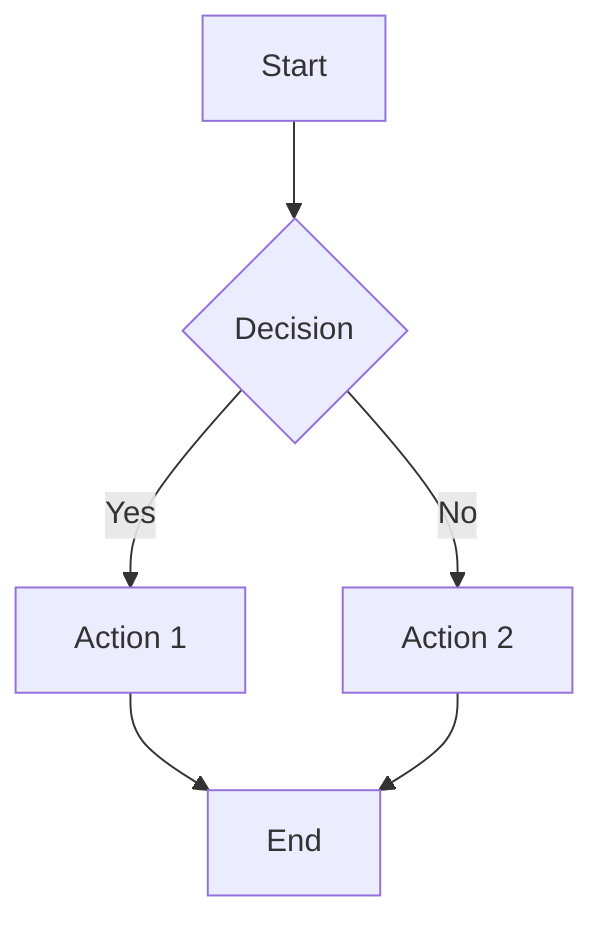
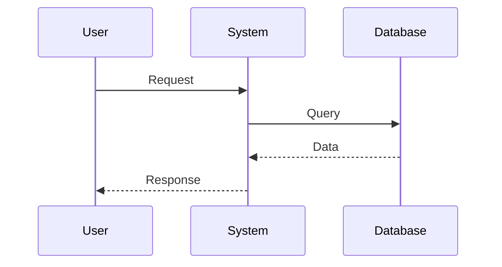
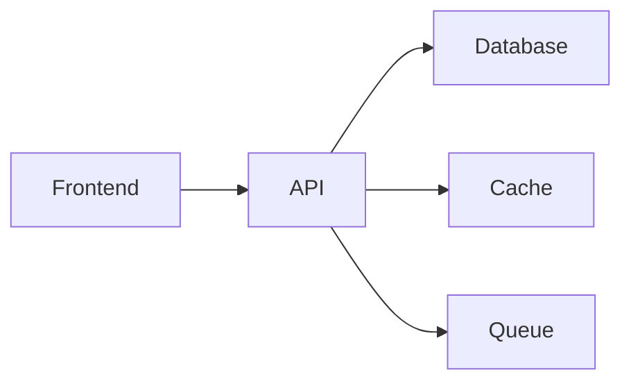
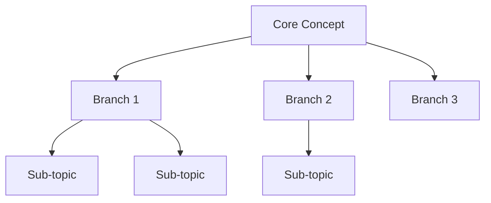
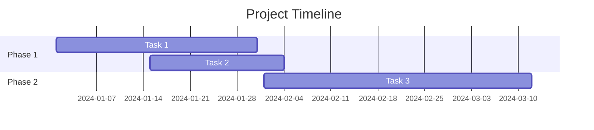

# Visual Assets

Generate Midjourney prompts, provide diagram guidance, and specify visual asset requirements for social media posts.

## Asset Categories

### AI-Generated Images
Midjourney prompts for:
- Cyberpunk/futuristic aesthetics
- Abstract concepts
- Mood/atmosphere pieces
- Brand-aligned visuals

### Diagrams & Charts
Mermaid diagrams for:
- Flowcharts
- Architecture diagrams
- Process flows
- Mind maps
- Timelines

### Screenshots & Mockups
Guidelines for:
- UI/UX showcases
- Code snippets
- Tool interfaces
- Design systems

### Video Thumbnails
Specs for:
- YouTube thumbnails
- Video covers
- Story highlights

## Midjourney Prompt Framework

### Base Structure
```
[Subject] [Style] [Mood/Atmosphere] [Technical specs]
```

### Your Brand Aesthetic

**Color palette:**
- Carbon black (#0A0A0A)
- Neon cyan (#00F0FF)
- Solar amber (#FFA500)

**Style keywords:**
- Cyberpunk
- Minimalist
- Futuristic
- High contrast
- Neon accents
- Dark atmosphere
- Clean architecture

### Prompt Templates

**Cyberpunk aesthetic:**
```
minimalist cyberpunk [subject], neon cyan and amber highlights, 
dark carbon background, futuristic architecture, clean lines, 
high contrast, 8k, ultra detailed --ar 16:9 --style raw
```

**Abstract concept:**
```
abstract visualization of [concept], geometric shapes, 
flowing data streams, neon cyan glow, dark void background, 
minimal composition, futuristic --ar 1:1 --style raw
```

**Workspace/environment:**
```
minimalist workspace, holographic screens, neon lighting, 
dark modern interior, cyberpunk aesthetic, clean surfaces, 
ambient cyan glow, ultra detailed --ar 4:3 --style raw
```

**Technology focus:**
```
[tech concept] visualization, circuit patterns, data flow, 
neon cyan and amber accents, dark background, futuristic ui, 
minimal design, high tech --ar 16:9 --style raw
```

## Aspect Ratios by Platform

**X/Twitter:**
- Single image: 16:9 (1200x675px)
- Card: 1.91:1 (1200x627px)

**LinkedIn:**
- Post image: 1.91:1 (1200x627px)
- Article: 1200x627px

**Instagram:**
- Square: 1:1 (1080x1080px)
- Portrait: 4:5 (1080x1350px)
- Stories: 9:16 (1080x1920px)

**YouTube:**
- Thumbnail: 16:9 (1280x720px)
- Shorts: 9:16 (1080x1920px)

## Mermaid Diagram Types

### Flowchart


**Use for:**
- Process flows
- Decision trees
- User journeys
- System logic

### Sequence Diagram


**Use for:**
- API interactions
- User flows
- System communications
- Workflow steps

### Architecture Diagram


**Use for:**
- System architecture
- Tech stacks
- Component relationships
- Data flow

### Mind Map


**Use for:**
- Brainstorming
- Concept breakdown
- Feature planning
- Learning paths

### Timeline


**Use for:**
- Project schedules
- Roadmaps
- Progress tracking
- Milestones

## Screenshot Guidelines

### Code Snippets

**Format:**
- Dark theme (VS Code dark+)
- Syntax highlighting
- Clear font (Fira Code, JetBrains Mono)
- No line numbers (unless teaching)
- Crop to relevant code only

**Platforms:**
- Carbon.now.sh
- Ray.so
- Built-in VS Code screenshot

### UI/UX Showcases

**Elements:**
- Clean background
- Device mockup (optional)
- Focus on relevant area
- High resolution
- Annotate if explaining

**Tools:**
- Figma export
- Screenshot with annotation
- Before/after comparison

### Design Systems

**Show:**
- Component library
- Color palette
- Typography scale
- Spacing system
- Usage examples

**Format:**
- Grid layout
- Labeled clearly
- Consistent style
- High contrast

## YouTube Thumbnail Strategy

### Effective Formula

**Elements:**
1. Your face (if relevant) - left side
2. Key visual/screenshot - right side
3. Bold text - 4-6 words max
4. High contrast background

**Template:**
```
Background: Dark carbon (#0A0A0A)
Accent: Neon cyan or amber
Text: Large, white, bold font
Visual: Screenshot or icon
Border: Optional thin accent line
```

### Text Guidelines

**Good:**
- "Design System Tips"
- "AI Tools Review"
- "Build in Public"

**Bad:**
- "The Ultimate Complete Guide to..."
- Too many words
- Small text
- Low contrast

### A/B Test Elements

**Variables:**
- Face vs no face
- Text position
- Color scheme
- Visual style
- Text length

## Visual Content Calendar

### X/Twitter
- 30% text only
- 50% with image
- 20% with video/GIF

### LinkedIn
- 60% text only
- 30% with image
- 10% with document/carousel

### Instagram
- 100% visual required
- Mix: 40% photos, 40% graphics, 20% video

### YouTube
- 100% thumbnail required
- Mix: 70% with face, 30% without

## Asset Production Workflow

### For Each Post Type

**1. Identify need:**
- Does this post need a visual?
- What type of visual?
- What's the message?

**2. Choose format:**
- Photo/render
- Diagram
- Screenshot
- Mockup
- Text graphic

**3. Generate/create:**
- Midjourney prompt
- Mermaid diagram code
- Screenshot guidance
- Design tool instructions

**4. Specify dimensions:**
- Platform requirements
- Optimal size
- Aspect ratio
- File format

**5. Provide instructions:**
- Where to create
- How to export
- What to emphasize
- Brand alignment

## Quick Visual Prompts

### Concept Visualization
```
When: Explaining abstract ideas
Prompt: "abstract visualization of [concept], geometric forms, 
data visualization style, neon cyan accents, dark background, 
minimal, futuristic --ar 16:9 --style raw"
```

### Tool Interface
```
When: Showcasing software
Method: Clean screenshot with annotations
Tools: Snagit, CleanShot X, or built-in
Style: Crop tight, highlight key areas
```

### Process Flow
```
When: Explaining workflows
Type: Mermaid flowchart
Style: Left-to-right or top-to-bottom
Elements: Clear labels, decision points, endpoints
```

### Comparison
```
When: Before/after, A vs B
Format: Side-by-side split
Labels: Clear indicators
Style: Equal sizing, aligned
```

## Brand Consistency

**Always include:**
- Dark mode aesthetic
- Minimalist approach
- High contrast
- Clean typography
- Limited color palette

**Never include:**
- Bright, saturated backgrounds
- Cluttered layouts
- Generic stock photos
- Mismatched fonts
- Too many colors

## Efficiency Tips

**Batch creation:**
- Generate multiple Midjourney variations
- Create diagram templates
- Prepare screenshot setup
- Save thumbnail templates

**Reusability:**
- Template styles
- Common diagrams
- Brand elements
- Color schemes

**Tools:**
- Midjourney for AI art
- Mermaid for diagrams
- Figma for mockups
- Carbon for code
- Canva for quick graphics

## Asset Library Structure

```
/assets
├── /midjourney-renders
│   ├── cyberpunk-scenes
│   ├── abstract-concepts
│   └── ui-visualizations
├── /diagrams
│   ├── process-flows
│   ├── architecture
│   └── mind-maps
├── /screenshots
│   ├── code-snippets
│   ├── ui-examples
│   └── tool-interfaces
└── /thumbnails
    ├── youtube
    └── templates
```

## Output Format

When providing visual asset guidance:

```markdown
## Visual Asset - [Post Title]

**Type:** [Midjourney/Diagram/Screenshot/etc]
**Platform:** [X/LinkedIn/Instagram/YouTube]
**Dimensions:** [Width x Height]
**Aspect Ratio:** [Ratio]

**Purpose:**
[What this visual should communicate]

**Instructions:**
[Specific creation steps]

**Midjourney Prompt:** (if applicable)
```
[Full prompt with parameters]
```

**Mermaid Code:** (if applicable)
```mermaid
[Diagram code]
```

**Screenshot Guide:** (if applicable)
[What to capture, how to frame, tools to use]

**Brand Alignment:**
- Colors: [Specific palette]
- Style: [Aesthetic notes]
- Mood: [Atmosphere]
```

## Quality Checklist

Before using any visual:
- [ ] High resolution (platform-appropriate)
- [ ] Brand colors if applicable
- [ ] Clear, readable text
- [ ] High contrast
- [ ] Proper dimensions
- [ ] Relevant to content
- [ ] Professional quality
- [ ] No copyright issues

## Next Steps

Ready to create visual assets? Specify:
- Post topic and platform?
- Visual type needed?
- Specific message to convey?
- Any style preferences?

I'll provide complete instructions including Midjourney prompts, Mermaid diagrams, or screenshot guidance as needed.
